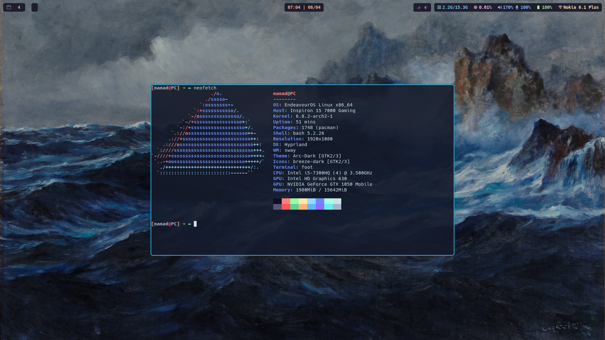
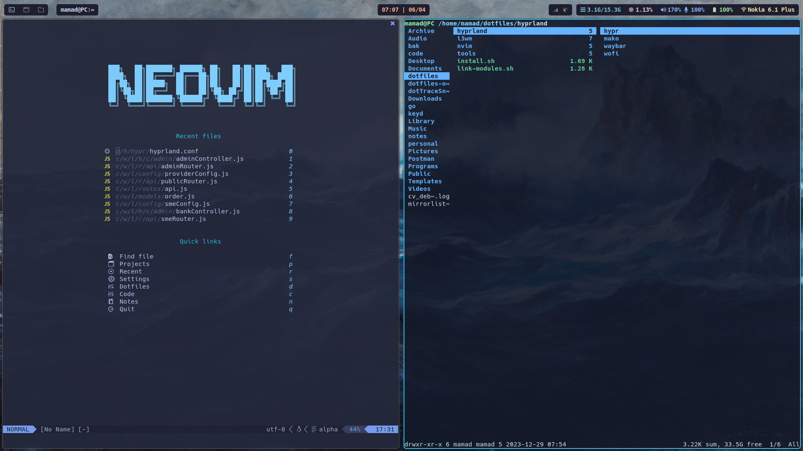
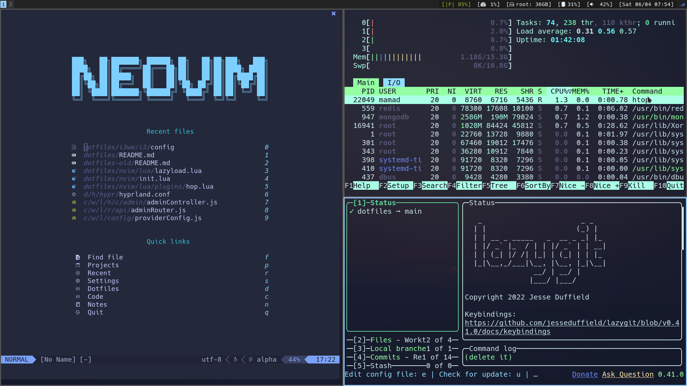

# Dotfiles

## Hyprland

<p align="center">
    
    
</p>

## i3wm

<p align="center">
    
    
</p>

this is my .dotfile repository for both i3wm and hyprland.

# Install

`install.sh` file is written for arch base distros. but you can take a look at it and download necessary packages for your distro.

1. clone repository:

```bash
git clone --recurse-submodules https://github.com/dalmamad/dotfiles.git
```

2. change directory to the repo:

```bash
cd dotfiles
```

3. run `install.sh` (make sure `yay` is installed):

```bash
./install.sh
```
