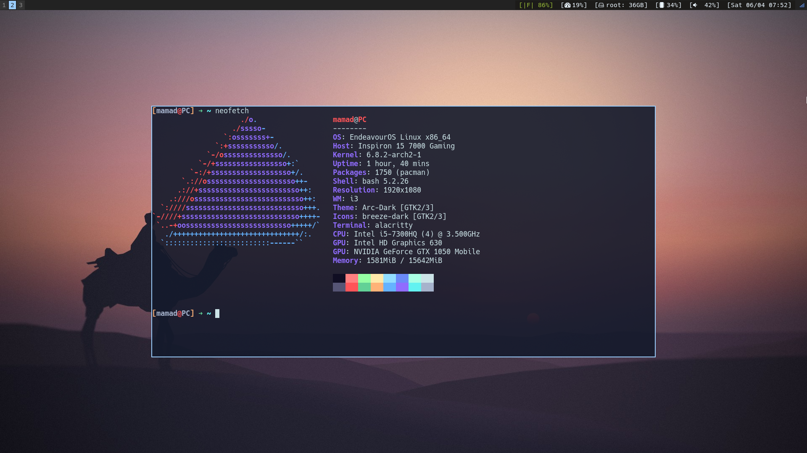

# Dotfiles

this is my .dotfile repository for both i3wm and hyprland.

## Hyprland

<p align="center">
    
    
</p>

## i3wm

<p align="center">
    
    
</p>

# Install

> this installation script is made for arch linux and is using pacman to install packages. also i'm using endevour os so you may need to install some of the packages that are installed in endevour os by default like graphic drivers if you are using vanilla arch for example.

1. clone repository:

```bash
git clone --recurse-submodules https://github.com/dalmamad/dotfiles.git
```

2. change directory to the repo:

```bash
cd dotfiles
```

3. run `install.sh` (make sure `yay` is installed):

```bash
./install.sh
```
